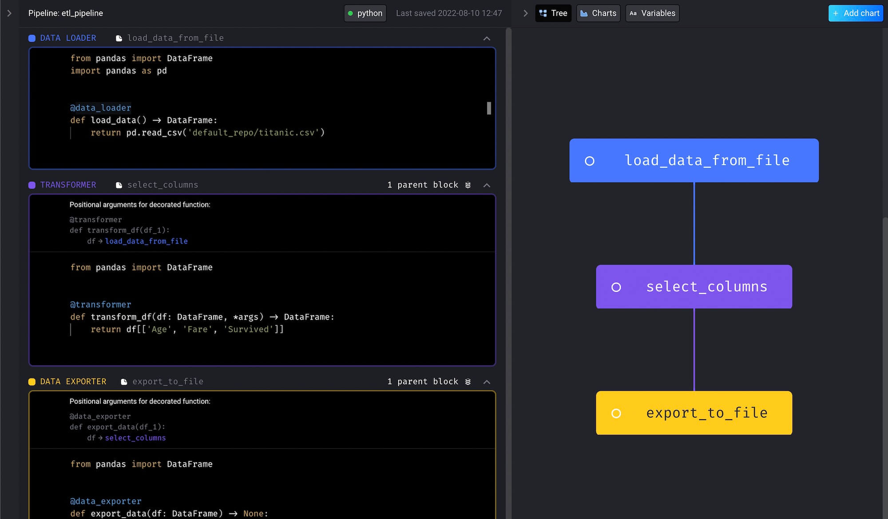

<h1 align="center">
  <a
    target="_blank"
    href="https://mage.ai"
  >
    
  </a>
</h1>
<p align="center">
  🧙 A modern replacement for Airflow.
</p>

<p align="center">
  <a
    href="https://docs.mage.ai"
    target="_blank"
  ><b>Documentation</b></a>&nbsp;&nbsp;&nbsp;🌪️&nbsp;&nbsp;&nbsp;
  <a
    href="https://www.youtube.com/watch?v=hrsErfPDits"
    target="_blank"
  ><b>Watch 2 min demo</b></a>&nbsp;&nbsp;&nbsp;🌊&nbsp;&nbsp;&nbsp;
  <a
    href="https://demo.mage.ai"
    target="_blank"
  ><b>Play with live tool</b></a>&nbsp;&nbsp;&nbsp;🔥&nbsp;&nbsp;&nbsp;
  <a
    href="https://www.mage.ai/chat"
    target="_blank"
  >
    <b>Get instant help</b>
  </a>
</p>
<div align="center">
  <a
    href="https://pypi.org/project/mage-ai/"
    target="_blank"
  >
    
  </a>
  <a
    href="https://anaconda.org/conda-forge/mage-ai"
    target="_blank"
  >
    
  </a>
  <a
    href="https://opensource.org/licenses/Apache-2.0"
    target="_blank"
  >
    
  </a>
  <a
    href="https://join.slack.com/t/mageai/shared_invite/zt-1adn34w4m-t~TcnPTlo3~5~d_0raOp6A"
    target="_blank"
  >
    
  </a>
  <a
    href="https://github.com/mage-ai/mage-ai"
    target="_blank"
  >
    
  </a>
  <a
    href="https://hub.docker.com/r/mageai/mageai"
    target="_blank"
  >
    
  </a>
</div>


<div align="center">

### Give your data team `magical` powers

</div>

<p align="center">
  <b>Integrate</b> and synchronize data from 3rd party sources
</p>

<p align="center">
  Build real-time and batch pipelines to <b>transform</b> data using Python, SQL, and R
</p>

<p align="center">
  Run, monitor, and <b>orchestrate</b> thousands of pipelines without losing sleep
</p>

<br />

<p align="center">1️⃣ 🏗️</p>
<h1 align="center">Build</h1>
<p align="center">
  Have you met anyone who said they loved developing in Airflow?
  <br />
  That’s why we designed an easy developer experience that you’ll enjoy.
</p>

|   |   |
| --- | --- |
| <b>Easy developer experience</b><br />Start developing locally with a single command or launch a dev environment in your cloud using Terraform.<br /><br/><b>Language of choice</b><br />Write code in Python, SQL, or R in the same data pipeline for ultimate flexibility.<br /><br /><b>Engineering best practices built-in</b><br />Each step in your pipeline is a standalone file containing modular code that’s reusable and testable with data validations. No more DAGs with spaghetti code. |  |

<p align="center">
  ↓
</p>

<p align="center">2️⃣ 🔮</p>
<h1 align="center">Preview</h1>
<p align="center">
  Stop wasting time waiting around for your DAGs to finish testing.
  <br />
  Get instant feedback from your code each time you run it.
</p>

|   |   |
| --- | --- |
| <b>Interactive code</b><br />Immediately see results from your code’s output with an interactive notebook UI.<br /><br/><b>Data is a first-class citizen</b><br />Each block of code in your pipeline produces data that can be versioned, partitioned, and cataloged for future use.<br /><br /><b>Collaborate on cloud</b><br />Develop collaboratively on cloud resources, version control with Git, and test pipelines without waiting for an available shared staging environment. |  |

<p align="center">
  ↓
</p>

<p align="center">3️⃣ 🚀</p>
<h1 align="center">Launch</h1>
<p align="center">
  Don’t have a large team dedicated to Airflow?
  <br />
  Mage makes it easy for a single developer or small team to scale up and manage thousands of pipelines.
</p>

|   |   |
| --- | --- |
| <b>Fast deploy</b><br />Deploy Mage to AWS, GCP, or Azure with only 2 commands using maintained Terraform templates.<br /><br/><b>Scaling made simple</b><br />Transform very large datasets directly in your data warehouse or through a native integration with Spark.<br /><br /><b>Observability</b><br />Operationalize your pipelines with built-in monitoring, alerting, and observability through an intuitive UI. |  |

<br />

# 🧙 Intro

Mage is an open-source data pipeline tool for transforming and integrating data.

1. [Quick start](#%EF%B8%8F-quick-start)
1. [Demo](#-demo)
1. [Tutorials](#-tutorials)
1. [Documentation](https://docs.mage.ai)
1. [Features](#-features)
1. [Core design principles](https://docs.mage.ai/design/core-design-principles)
1. [Core abstractions](https://docs.mage.ai/design/core-abstractions)
1. [Contributing](https://docs.mage.ai/community/contributing)

<br />

# 🏃‍♀️ Quick start

You can install and run Mage using Docker (recommended), `pip`, or `conda`.

### Install using Docker

1. Create a new project and launch tool (change `demo_project` to any other name if you want):
    ```bash
    docker run -it -p 6789:6789 -v $(pwd):/home/src mageai/mageai \
      /app/run_app.sh mage start demo_project
    ```

    <sub>Want to use Spark or other integrations? Read more about [integrations](https://docs.mage.ai/data-integrations/overview).</sub>

1. Open [http://localhost:6789](http://localhost:6789) in your browser and build a pipeline.

### Using `pip` or `conda`

1. Install Mage
    ```bash
    pip install mage-ai
    ```

    or

    ```bash
    conda install -c conda-forge mage-ai
    ```

    <sub>For additional packages (e.g. `spark`, `postgres`, etc), please see [Installing extra packages](https://docs.mage.ai/getting-started/setup#installing-extra-packages).</sub>

    <sub>If you run into errors, please see [Install errors](https://docs.mage.ai/getting-started/setup#errors).</sub>

1. Create new project and launch tool (change `demo_project` to any other name if you want):
    ```bash
    mage start demo_project
    ```
1. Open [http://localhost:6789](http://localhost:6789) in your browser and build a pipeline.

<br />

# 🎮 Demo

### Live demo

Build and run a data pipeline with our <b>[demo app](https://demo.mage.ai/)</b>.

> WARNING
>
> The live demo is public to everyone, please don’t save anything sensitive (e.g. passwords, secrets, etc).
### Demo video (2 min)

[](https://www.youtube.com/watch?v=hrsErfPDits "Mage quick start demo")

<sub><i>Click the image to play video</i></sub>

<br />

# 👩‍🏫 Tutorials

- [Load data from API, transform it, and export it to PostgreSQL](https://docs.mage.ai/tutorials/load-api-data)
- [Integrate Mage into an existing Airflow project](https://docs.mage.ai/integrations/dbt-models)
- [Train model on Titanic dataset](https://docs.mage.ai/tutorials/train-model)
- [Set up DBT models and orchestrate DBT runs](https://docs.mage.ai/integrations/airflow)


<br />

# 🔮 [Features](https://docs.mage.ai/about/features)

|   |   |   |
| --- | --- | --- |
| 🎶 | <b>[Orchestration](https://docs.mage.ai/design/data-pipeline-management)</b> | Schedule and manage data pipelines with observability. |
| 📓 | <b>[Notebook](https://docs.mage.ai/about/features#notebook-for-building-data-pipelines)</b> | Interactive Python, SQL, & R editor for coding data pipelines. |
| 🏗️ | <b>[Data integrations](https://docs.mage.ai/data-integrations/overview)</b> | Synchronize data from 3rd party sources to your internal destinations. |
| 🚰 | <b>[Streaming pipelines](https://docs.mage.ai/guides/streaming-pipeline)</b> | Ingest and transform real-time data. |
| ❎ | <b>[DBT](https://docs.mage.ai/dbt/overview)</b> | Build, run, and manage your DBT models with Mage. |

<b>A sample data pipeline defined across 3 files ➝</b>

1. Load data ➝
    ```python
    @data_loader
    def load_csv_from_file():
        return pd.read_csv('default_repo/titanic.csv')
    ```
1. Transform data ➝
    ```python
    @transformer
    def select_columns_from_df(df, *args):
        return df[['Age', 'Fare', 'Survived']]
    ```
1. Export data ➝
    ```python
    @data_exporter
    def export_titanic_data_to_disk(df) -> None:
        df.to_csv('default_repo/titanic_transformed.csv')
    ```

<b>What the data pipeline looks like in the UI ➝</b>



New? We recommend reading about <b>[blocks](https://docs.mage.ai/design/blocks)</b> and
learning from a <b>[hands-on tutorial](https://docs.mage.ai/tutorials/load-api-data)</b>.

[](https://www.mage.ai/chat)

<br />

# 🏔️ [Core design principles](https://docs.mage.ai/design/core-design-principles)

Every user experience and technical design decision adheres to these principles.

|   |   |   |
| --- | --- | --- |
| 💻 | [Easy developer experience](https://docs.mage.ai/design/core-design-principles#easy-developer-experience) | Open-source engine that comes with a custom notebook UI for building data pipelines. |
| 🚢 | [Engineering best practices built-in](https://docs.mage.ai/design/core-design-principles#engineering-best-practices-built-in) | Build and deploy data pipelines using modular code. No more writing throwaway code or trying to turn notebooks into scripts. |
| 💳 | [Data is a first-class citizen](https://docs.mage.ai/design/core-design-principles#data-is-a-first-class-citizen) | Designed from the ground up specifically for running data-intensive workflows. |
| 🪐 | [Scaling is made simple](https://docs.mage.ai/design/core-design-principles#scaling-is-made-simple) | Analyze and process large data quickly for rapid iteration. |

<br />

# 🛸 [Core abstractions](https://docs.mage.ai/design/core-abstractions)

These are the fundamental concepts that Mage uses to operate.

|   |   |
| --- | --- |
| [Project](https://docs.mage.ai/design/core-abstractions#project) | Like a repository on GitHub; this is where you write all your code. |
| [Pipeline](https://docs.mage.ai/design/core-abstractions#pipeline) | Contains references to all the blocks of code you want to run, charts for visualizing data, and organizes the dependency between each block of code. |
| [Block](https://docs.mage.ai/design/core-abstractions#block) | A file with code that can be executed independently or within a pipeline. |
| [Data product](https://docs.mage.ai/design/core-abstractions#data-product) | Every block produces data after it's been executed. These are called data products in Mage. |
| [Trigger](https://docs.mage.ai/design/core-abstractions#trigger) | A set of instructions that determine when or how a pipeline should run. |
| [Run](https://docs.mage.ai/design/core-abstractions#run) | Stores information about when it was started, its status, when it was completed, any runtime variables used in the execution of the pipeline or block, etc. |

<br />

# 🙋‍♀️ Contributing and developing

Add features and instantly improve the experience for everyone.

Check out the <b>[contributing guide](https://docs.mage.ai/community/contributing)</b>
to setup your development environment and start building.

<br />

# 👨‍👩‍👧‍👦 Community
Individually, we’re a mage.

> 🧙 Mage
>
> Magic is indistinguishable from advanced technology.
> A mage is someone who uses magic (aka advanced technology).
Together, we’re Magers!

> 🧙‍♂️🧙 Magers (`/ˈmājər/`)
>
> A group of mages who help each other realize their full potential!
Let’s hang out and chat together ➝

[](https://www.mage.ai/chat)

For real-time news, fun memes, data engineering topics, and more, join us on ➝

|   |   |
| --- | --- |
|  | [Twitter](https://twitter.com/mage_ai) |
|  | [LinkedIn](https://www.linkedin.com/company/magetech/mycompany) |
|  | [GitHub](https://github.com/mage-ai/mage-ai) |
|  | [Slack](https://www.mage.ai/chat) |

<br />

# 🤔 Frequently Asked Questions (FAQs)

Check out our [FAQ page](https://www.notion.so/mageai/Mage-FAQs-33d93ee65f934ed39568f8a4bc823b39) to find answers to some of our most asked questions.

<br />

# 🪪 License
See the [LICENSE](LICENSE) file for licensing information.

[](https://www.mage.ai/)

<br />
