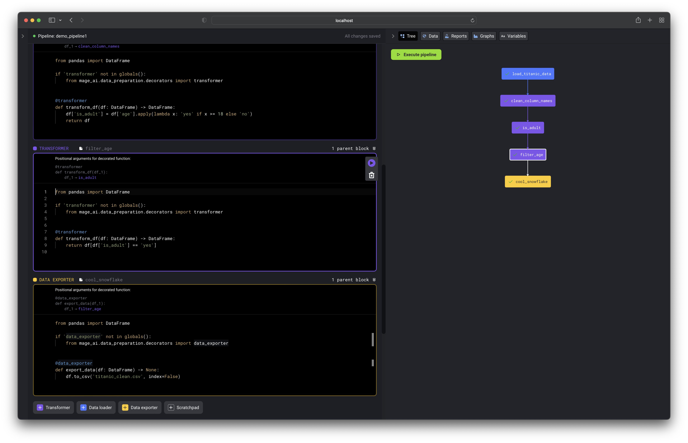
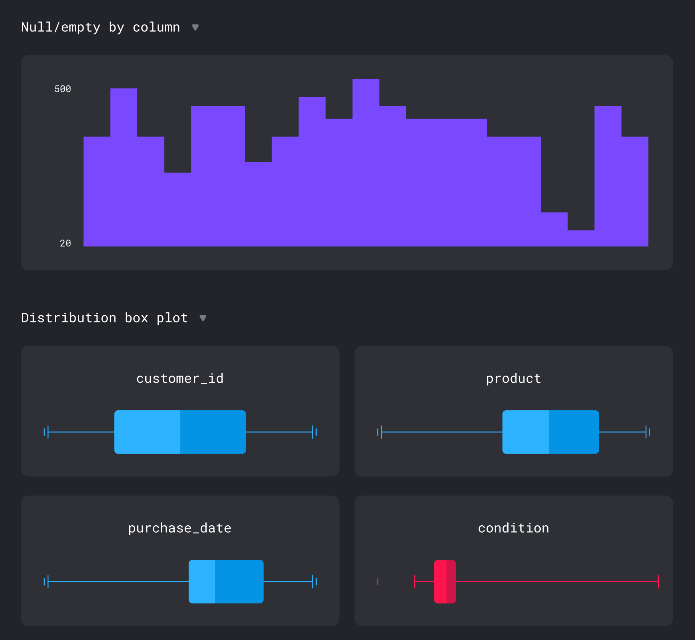

[](https://pypi.org/project/mage-ai/)
[](https://app.circleci.com/pipelines/github/mage-ai/mage-ai?branch=master&filter=all)
[](https://opensource.org/licenses/Apache-2.0)
[](https://join.slack.com/t/mageai/shared_invite/zt-1adn34w4m-t~TcnPTlo3~5~d_0raOp6A)

# Intro

Mage is an open-source code editor for <b>transforming data</b> and building <b>ML pipelines</b>.


> Join us on
> **[ Slack](https://www.mage.ai/chat)**

**Table of contents**

1. [Quick start](#%EF%B8%8F-quick-start)
1. [Features](#-features)
1. [Contributing](#%EF%B8%8F-contributing)
1. [Community](#-community)

# 🏃‍♀️ Quick start


### Using Docker

##### 1. Clone repository
```bash
$ git clone https://github.com/mage-ai/mage-ai.git && cd mage-ai
```

##### 2. Create new project
```bash
$ ./scripts/init.sh --project [project_name]
```

##### 3. Launch editor
```bash
$ ./scripts/start.sh --project [project_name]
```

Open [http://localhost:6789](http://localhost:6789) in your browser.

##### 4. Run pipeline
```bash
$ ./scripts/run.sh --project [project_name]
```

### Using pip

##### 1. Install Mage
```bash
$ pip install mage-ai
```

##### 2. Create new project
```bash
$ mage init [project_name]
```

##### 3. Launch editor
```bash
$ mage start [project_name]
```

Open [http://localhost:6789](http://localhost:6789) in your browser.

##### 4. Run pipeline
```bash
$ mage run [project_name] [pipeline]
```

# 🔮 Features

1. [Data centric editor](#1-data-centric-editor)
1. [Production ready code](#2-production-ready-code)
1. [Extensible](#3-extensible)

### 1. Data centric editor
An interactive coding experience designed for preparing data to train ML models.

Visualize the impact of your code every time you load, clean, and transform data.


### 2. Production ready code
No more writing throw away code or trying to turn notebooks into scripts.

Each cell block in this editor is a modular file that can be tested, reused,
and chained together to create an executable data pipeline locally or in any environment.



### 3. Extensible
Easily add new functionality directly in the source code or through plug-ins (coming soon).

Adding new API endpoints ([Tornado](https://www.tornadoweb.org/en/stable/)),
transformations (Python, PySpark, SQL),
and charts (using [React](https://reactjs.org/)) is easy to do (tutorial coming soon).



# 🙋‍♀️ Contributing
We welcome all contributions to Mage;
from small UI enhancements to brand new cleaning actions.
We love seeing community members level up and give people power-ups!

Check out the [🎁 contributing guide](/docs/contributing/README.md) to get started
by setting up your development environment and
exploring the code base.

Got questions? Live chat with us in
[ Slack](https://www.mage.ai/chat)

Anything you contribute, the Mage team and community will maintain. We’re in it together!

# 🧙 Community
We love the community of Magers (`/ˈmājər/`);
a group of mages who help each other realize their full potential!

To live chat with the Mage team and community,
please join the free Mage [ Slack](https://www.mage.ai/chat)
channel.

For real-time news and fun memes, check out the Mage
[ Twitter](https://twitter.com/mage_ai).

To report bugs or add your awesome code for others to enjoy,
visit [GitHub](https://github.com/mage-ai/mage-ai).

# 🪪 License
See the [LICENSE](LICENSE) file for licensing information.

<br />

[](https://www.mage.ai/)
