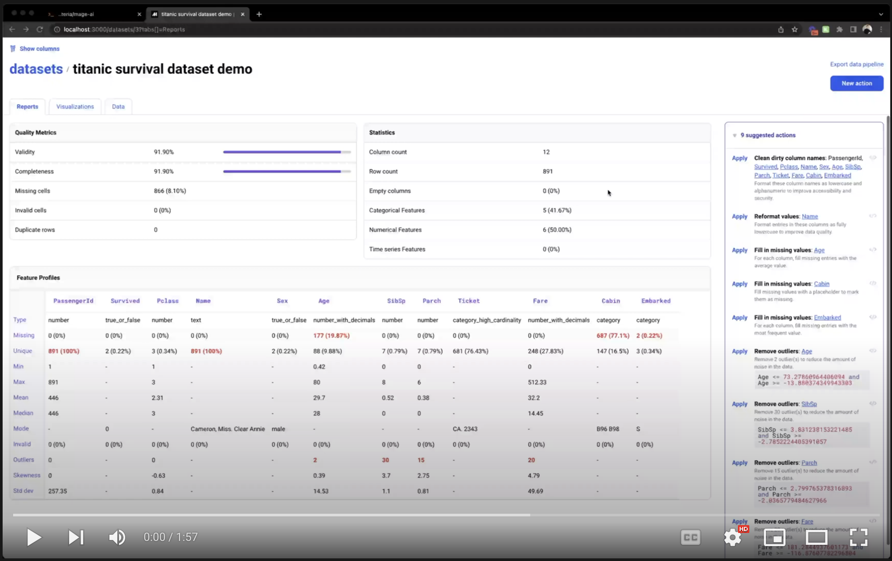
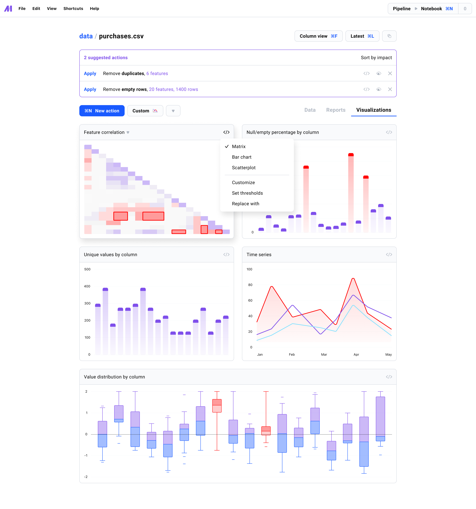
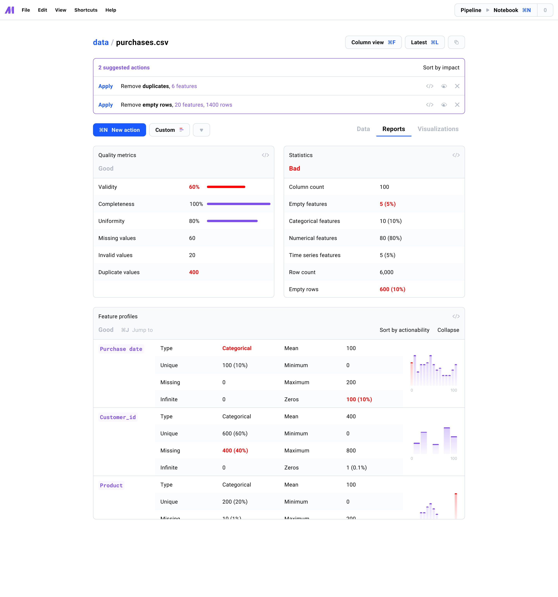
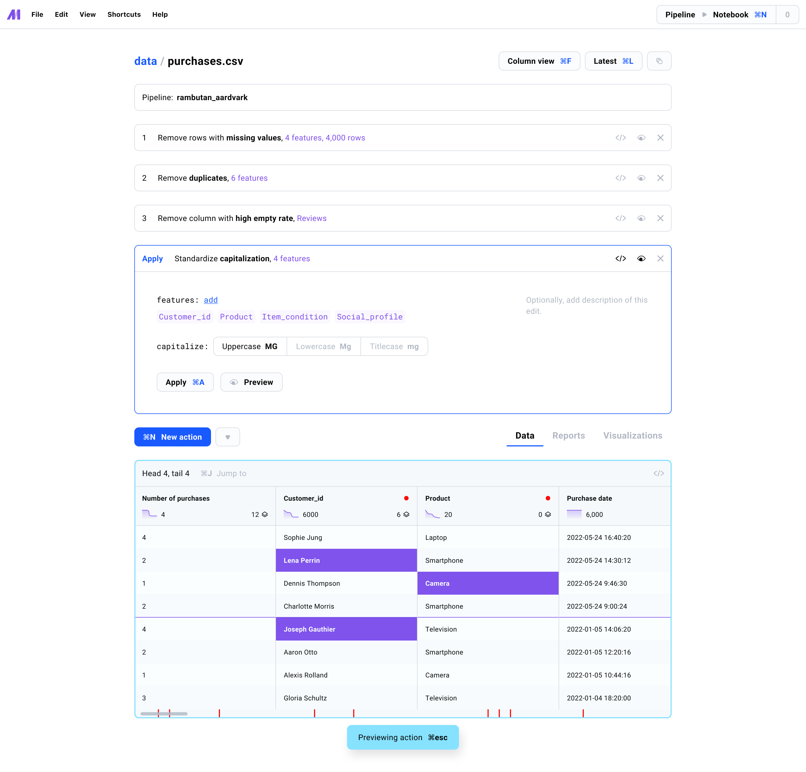
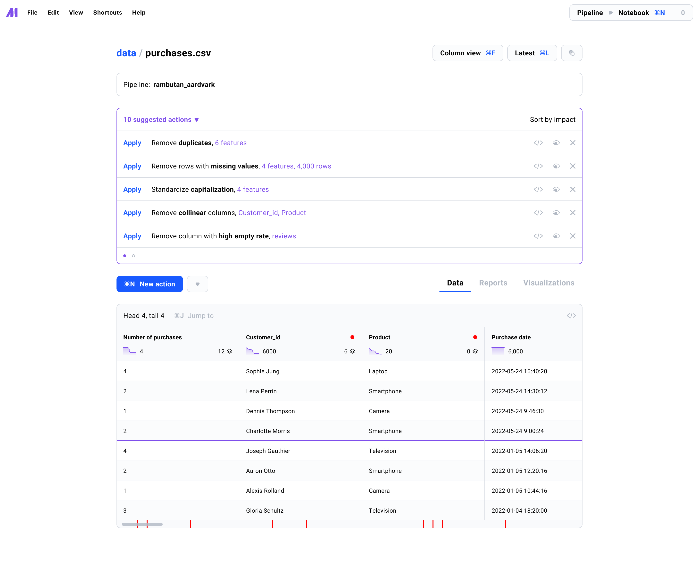

[](https://pypi.org/project/mage-ai/)
[](#)
[](https://opensource.org/licenses/Apache-2.0)
[](https://join.slack.com/t/mageai/shared_invite/zt-1adn34w4m-t~TcnPTlo3~5~d_0raOp6A)
[](https://colab.research.google.com/drive/1Pc6dpAolwuSKuoOEpWSWgx6MbNraSMVE?usp=sharing)

# Intro

Mage is an open-source data management platform
that helps you
<b>clean data</b> and
prepare it for training AI/ML models.

<kbd>
  
</kbd>

<br />
<br />

> Join us on
> **[ Slack](https://www.mage.ai/chat)**

### What does this do?
The current version of Mage includes a data cleaning UI tool that can run locally on your laptop or
can be hosted in your own cloud environment.

### Why should I use it?
Using a data cleaning tool enables you to quickly visualize data quality issues,
easily fix them, and create repeatable data cleaning pipelines that can be used in
production environments (e.g. online re-training, inference, etc).

# Table of contents
1. [Quick start](#quick-start)
1. [Features](#features)
1. [Roadmap](#roadmap)
1. [Contributing](#contributing)
1. [Community](#community)

# Quick start

- Try a **[demo of Mage](https://colab.research.google.com/drive/1Pc6dpAolwuSKuoOEpWSWgx6MbNraSMVE?usp=sharing)** in Google Colab.
- Try a **[hosted version of Mage](http://18.237.55.91:5789/)**


### Install library
Install the most recent released version:
```bash
$ pip install mage-ai
```

### Launch tool
Load your data, connect it to Mage, and launch the tool locally.


From anywhere you can execute Python code (e.g. terminal, Jupyter notebook, etc.),
run the following:

```python
import mage_ai
from mage_ai.server.sample_datasets import load_dataset


df = load_dataset('titanic_survival.csv')
mage_ai.connect_data(df, name='titanic dataset')
mage_ai.launch()
```

Open [http://localhost:5789](http://localhost:5789) in your browser to access the tool locally.

To stop the tool, run this command: `mage_ai.kill()`

#### Custom host and port for tool

If you want to change the default host (`localhost`) and the default port (`5789`)
that the tool runs on, you can set 2 separate environment variables:

```bash
$ export HOST=127.0.0.1
$ export PORT=1337
```

#### Using tool in Jupyter notebook cell

You can run the tool inside a Jupyter notebook cell iFrame using the method:
`mage_ai.launch()` within a single cell.

Optionally, you can use the following arguments to change the default host and
port that the iFrame loads from:

```python
mage_ai.launch(iframe_host='127.0.0.1', iframe_port=1337)
```

### Cleaning data
After building a data cleaning pipeline from the UI,
you can clean your data anywhere you can execute Python code:

```python
import mage_ai
from mage_ai.server.sample_datasets import load_dataset


df = load_dataset('titanic_survival.csv')

# Option 1: Clean with pipeline uuid
df_cleaned = mage_ai.clean(df, pipeline_uuid='uuid_of_cleaning_pipeline')

# Option 2: Clean with pipeline config directory path
df_cleaned = mage_ai.clean(df, pipeline_config_path='/path_to_pipeline_config_dir')
```

### Demo video (2 min)

[](https://www.youtube.com/watch?v=cRib1zOaqWs "Mage quick start demo")

## More resources

Here is a [🗺️ step-by-step](docs/tutorials/quick-start.md) guide on how to use the tool.

1. [Jupyter notebook example](docs/tutorials/assets/quick-start.ipynb)
1. [Google Colaboratory (Colab) example](https://colab.research.google.com/drive/1Pc6dpAolwuSKuoOEpWSWgx6MbNraSMVE?usp=sharing)

Check out the [📚 tutorials](docs/tutorials/README.md) to quickly become a master of magic.

# Features

1. [Data visualizations](#data-visualizations)
1. [Reports](#reports)
1. [Cleaning actions](#cleaning-actions)
1. [Data cleaning suggestions](#data-cleaning-suggestions)

### Data visualizations
Inspect your data using different charts (e.g. time series, bar chart, box plot, etc.).

Here’s a list of available [charts](docs/charts/README.md).

<kbd>
  
</kbd>

### Reports
Quickly diagnose data quality issues with summary reports.

Here’s a list of available [reports](docs/reports/README.md).

<kbd>
  
</kbd>

### Cleaning actions
Easily add common cleaning functions to your pipeline with a few clicks.
Cleaning actions include imputing missing values, reformatting strings, removing duplicates,
and many more.

If a cleaning action you need doesn’t exist in the library,
you can write and save custom cleaning functions in the UI.

Here’s a list of available [cleaning actions](docs/actions/README.md).

<kbd>
  
</kbd>

### Data cleaning suggestions
The tool will automatically suggest different ways to clean your data and improve quality metrics.

Here’s a list of available [suggestions](docs/suggestions/README.md).

<kbd>
  
</kbd>

# Roadmap
Big features being worked on or in the design phase.

1. Encoding actions (e.g. one-hot encoding, label hasher, ordinal encoding, embeddings, etc.)
1. Data quality monitoring and alerting
1. Apply cleaning actions to columns and values that match a condition

Here’s a detailed list of [🪲 features and bugs](https://airtable.com/shrE1pn6fRsVlniOV)
that are in progress or upcoming.

# Contributing
We welcome all contributions to Mage;
from small UI enhancements to brand new cleaning actions.
We love seeing community members level up and give people power-ups!

Check out the [🎁 contributing guide](/docs/contributing/README.md) to get started
by setting up your development environment and
exploring the code base.

Got questions? Live chat with us in
[ Slack](https://www.mage.ai/chat)

Anything you contribute, the Mage team and community will maintain. We’re in it together!

# Community
We love the community of Magers (`/ˈmājər/`);
a group of mages who help each other realize their full potential!

To live chat with the Mage team and community,
please join the free Mage [ Slack](https://www.mage.ai/chat)
channel.

For real-time news and fun memes, check out the Mage
[ Twitter](https://twitter.com/mage_ai).

To report bugs or add your awesome code for others to enjoy,
visit [GitHub](https://github.com/mage-ai/mage-ai).

# License
See the [LICENSE](LICENSE) file for licensing information.

<br />

[](https://www.mage.ai/)
