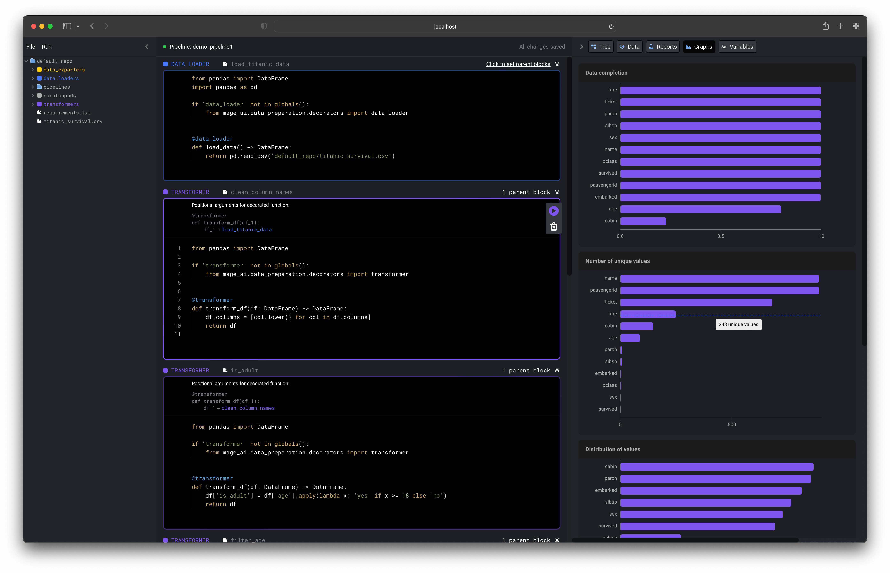

[](https://pypi.org/project/mage-ai/)
[](https://app.circleci.com/pipelines/github/mage-ai/mage-ai?branch=master&filter=all)
[](https://opensource.org/licenses/Apache-2.0)
[](https://join.slack.com/t/mageai/shared_invite/zt-1adn34w4m-t~TcnPTlo3~5~d_0raOp6A)

# Intro

Mage is an open-source tool for <b>building</b> and <b>deploying</b> data pipelines.

Here is a sample data pipeline defined across 3 files:

```python
# load_data_from_file.py
import pandas as pd


@data_loader
def load_data():
    return pd.read_csv('default_repo/titanic.csv')
```

```python
# select_columns.py
@transformer
def transform_df(df, *args):
    return df[['Age', 'Fare', 'Survived']]
```

```python
# export_to_file.py
@data_exporter
def export_data(df) -> None:
    df.to_csv('default_repo/titanic_transformed.csv')
```

What the data pipeline looks like in the UI:


New? We recommend reading about [blocks](docs/blocks/README.md) and
learning from a [hands-on tutorial](docs/tutorials/quick_start/etl_restaurant/README.md).

[](https://www.mage.ai/chat)

**Table of contents**

1. [Quick start](#%EF%B8%8F-quick-start)
1. [Demo video](#-demo-video-2-min)
1. [Tutorials](#-tutorials)
1. [Features](#-features)
1. [Documentation](#documentation)
1. [Contributing](#%EF%B8%8F-contributing)
1. [Community](#-community)

# 🏃‍♀️ Quick start


You can install Mage using Docker or `pip`:

### Using Docker

Create a new project and launch tool (change `demo_project` to any other name if you want):

```bash
docker run -it -p 6789:6789 -v $(pwd):/home/src \
  mageai/mageai mage start demo_project
```

Open [http://localhost:6789](http://localhost:6789) in your browser and build a pipeline.

<sub>Follow the [guide](docs/kernels/README.md#pyspark-kernel-) if you want to use PySpark kernel in your notebook.</sub>

### Using pip

##### 1. Install Mage
```bash
pip install mage-ai
```

<sub>For additional packages (e.g. `spark`, `postgres`, etc), please see [Installing extra packages](docs/README.md#installing-extra-packages).</sub>

<sub>If you run into errors, please see [Install errors](docs/README.md#install-errors).</sub>

##### 2. Create new project and launch tool (change `demo_project` to any other name if you want):

```bash
mage start demo_project
```

Open [http://localhost:6789](http://localhost:6789) in your browser and build a pipeline.

<br />

# 🎮 Demo video (2 min)

[](https://www.youtube.com/watch?v=hrsErfPDits "Mage quick start demo")

<sub><i>Click the image to play video</i></sub>

<br />

# 👩‍🏫 Tutorials

- [Train model on Titanic dataset](docs/tutorials/quick_start/train_titanic_model/README.md)
- [Load data from API, transform it, and export it to PostgreSQL](docs/tutorials/quick_start/etl_restaurant/README.md)
- [Integrate Mage into an existing Airflow project](docs/tutorials/airflow/integrate_into_existing_project/README.md)

<br />

# 🔮 Features

Check out an overview of features [here](docs/features/README.md).



<br />

# 📚 Documentation

Read more docs [here](docs/README.md).

<br />

# 🙋‍♀️ Contributing
We welcome all contributions to Mage;
from small UI enhancements to brand new cleaning actions.
We love seeing community members level up and give people power-ups!

Check out the [🎁 contributing guide](/docs/contributing/README.md) to get started
by setting up your development environment and
exploring the code base.

Got questions? Live chat with us in
[ Slack](https://www.mage.ai/chat)

Anything you contribute, the Mage team and community will maintain. We’re in it together!

<br />

# 🧙 Community
We love the community of Magers (`/ˈmājər/`);
a group of mages who help each other realize their full potential!

To live chat with the Mage team and community,
please join the free Mage [ Slack](https://www.mage.ai/chat)
channel.

[](https://www.mage.ai/chat)

For real-time news and fun memes, check out the Mage
[ Twitter](https://twitter.com/mage_ai).

To report bugs or add your awesome code for others to enjoy,
visit [GitHub](https://github.com/mage-ai/mage-ai).

<br />

# 🪪 License
See the [LICENSE](LICENSE) file for licensing information.

[](https://www.mage.ai/)
