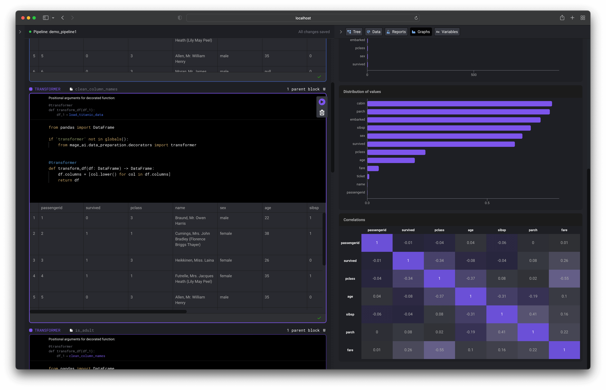

[](https://pypi.org/project/mage-ai/)
[](https://app.circleci.com/pipelines/github/mage-ai/mage-ai?branch=master&filter=all)
[](https://opensource.org/licenses/Apache-2.0)
[](https://join.slack.com/t/mageai/shared_invite/zt-1adn34w4m-t~TcnPTlo3~5~d_0raOp6A)

# Intro

Mage is an open-source notebook for <b>building</b> and <b>deploying</b> data pipelines.


A data pipeline defined across 3 different files:

```python
# load_data_from_file.py
from pandas import DataFrame
import pandas as pd


@data_loader
def load_data() -> DataFrame:
    return pd.read_csv('default_repo/titanic.csv')
```

```python
# select_columns.py
from pandas import DataFrame


@transformer
def transform_df(df: DataFrame, *args) -> DataFrame:
    return df[['Age', 'Fare', 'Survived']]
```

```python
# export_to_file.py
from pandas import DataFrame


@data_exporter
def export_data(df: DataFrame) -> None:
    return df.to_csv('default_repo/titanic_transformed.csv')
```

What the data pipeline looks like in the UI:


New? We recommend reading about [blocks](docs/blocks/README.md) and
learning from a [hands-on tutorial](docs/tutorials/quick_start/etl_restaurant/README.md).

[](https://www.mage.ai/chat)

**Table of contents**

1. [Quick start](#%EF%B8%8F-quick-start)
1. [Tutorials](#-tutorials)
1. [Features](#-features)
1. [Contributing](#%EF%B8%8F-contributing)
1. [Community](#-community)
1. [Documentation](docs/README.md)

# 🏃‍♀️ Quick start


You can install Mage using Docker or `pip`:

### Using Docker

Create a new project and launch tool (change `demo_project` to any other name if you want):

```bash
docker run -it -p 6789:6789 -v $(pwd):/home/src \
  mageai/mageai mage start demo_project
```

Open [http://localhost:6789](http://localhost:6789) in your browser and build a pipeline.

Follow the [guide](docs/kernels/README.md#pyspark-kernel-) if you want to use PySpark kernel in your notebook.

### Using pip

##### 1. Install Mage
```bash
pip install mage-ai
```

Mage also has the following extras:
* **spark**: to use Spark in your Mage pipeline
* **bigquery**: to connect to BigQuery for data import or export
* **postgres**: to connect to PostgreSQL for data import or export
* **redshift**: to connect to Redshift for data import or export
* **s3**: to connect to S3 for data import or export
* **snowflake**: to connect to Snowflake for data import or export
* **all**: to install all of the above to use all functionalities

```bash
pip install "mage-ai[spark]"
```

You may need to install development libraries for MIT Kerberos to use some Mage features. On Ubuntu, this can be installed as:
```bash
apt install libkrb5-dev
```

##### 2. Create new project and launch tool

(change `demo_project` to any other name if you want):

```bash
mage start demo_project
```

Open [http://localhost:6789](http://localhost:6789) in your browser and build a pipeline.

# 👩‍🏫 Tutorials

- [Train model on Titanic dataset](docs/tutorials/quick_start/train_titanic_model/README.md)
- [Load data from API, transform it, and export it to PostgreSQL](docs/tutorials/quick_start/etl_restaurant/README.md)
- [Integrate Mage into an existing Airflow project](docs/tutorials/airflow/integrate_into_existing_project/README.md)
- [Coming soon] How to visualize your data with charts

<br />

# 🔮 Features

1. [Data centric editor](#1-data-centric-editor)
1. [Production ready code](#2-production-ready-code)
1. [Extensible](#3-extensible)

### 1. Data centric editor
An interactive coding experience designed for preparing data to train ML models.

Visualize the impact of your code every time you load, clean, and transform data.



### 2. Production ready code
No more writing throw away code or trying to turn notebooks into scripts.

Each block (aka cell) in this editor is a modular file that can be tested, reused,
and chained together to create an executable data pipeline locally or in any environment.

Read more about <b>[blocks](docs/blocks/README.md)</b> and how they work.


Run your data pipeline end-to-end using the command line function: `$ mage run [project] [pipeline]`

You can run your pipeline in production environments with the orchestration tools
* [Airflow](docs/production/airflow.md)
* [Prefect](docs/production/prefect.md)
* Dagster (Tutorial coming soon)

### 3. Extensible
Easily add new functionality directly in the source code or through plug-ins (coming soon).

Adding new API endpoints ([Tornado](https://www.tornadoweb.org/en/stable/)),
transformations (Python, PySpark, SQL),
and charts (using [React](https://reactjs.org/)) is easy to do (tutorial coming soon).


### New features and changelog
Check out what’s new [here](https://mageai.notion.site/What-s-new-7cc355e38e9c42839d23fdbef2dabd2c).

# 🙋‍♀️ Contributing
We welcome all contributions to Mage;
from small UI enhancements to brand new cleaning actions.
We love seeing community members level up and give people power-ups!

Check out the [🎁 contributing guide](/docs/contributing/README.md) to get started
by setting up your development environment and
exploring the code base.

Got questions? Live chat with us in
[ Slack](https://www.mage.ai/chat)

Anything you contribute, the Mage team and community will maintain. We’re in it together!

# 🧙 Community
We love the community of Magers (`/ˈmājər/`);
a group of mages who help each other realize their full potential!

To live chat with the Mage team and community,
please join the free Mage [ Slack](https://www.mage.ai/chat)
channel.

[](https://www.mage.ai/chat)

For real-time news and fun memes, check out the Mage
[ Twitter](https://twitter.com/mage_ai).

To report bugs or add your awesome code for others to enjoy,
visit [GitHub](https://github.com/mage-ai/mage-ai).

# 🪪 License
See the [LICENSE](LICENSE) file for licensing information.

<br />

[](https://www.mage.ai/)
