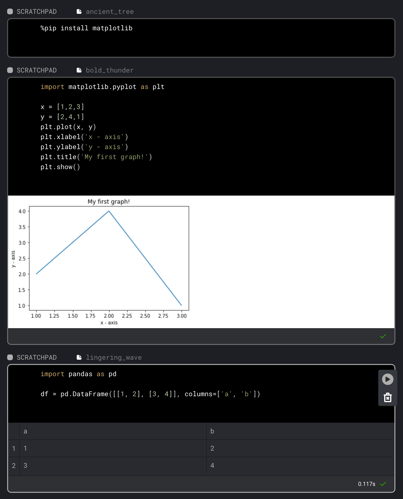

# Blocks

Each block (except a scratchpad block) in a pipeline maps to an individual file within a project.

Blocks can be reused and shared across multiple pipelines within the same project.

Current block types:

1. [Scratchpad](#1-scratchpad)
1. [Data loader](#2-data-loader)
1. [Transformer](#3-transformer)
1. [Data exporter](#4-data-exporter)

### 1. Scratchpad

Use these blocks to experiment and write throw away code.
Scratchpad blocks aren’t used when executing a pipeline.



### 2. Data loader

Write your code for fetching data from a remote source or loading it from disk.

```python
from pandas import DataFrame

if 'data_loader' not in globals():
    from mage_ai.data_preparation.decorators import data_loader


@data_loader
def load_data() -> DataFrame:
    """
    Template code for loading data from any source.

    Returns:
        DataFrame: Returned pandas data frame.
    """
    # Specify your data loading logic here
    return DataFrame({})
```

To read about Mage's data loading clients that interface with popular data storage systems, see docs on [Data Loading](./data_loading.md).

### 3. Transformer

Use these blocks to clean, transform, and enhance data from other blocks.

```python
from pandas import DataFrame

if 'transformer' not in globals():
    from mage_ai.data_preparation.decorators import transformer


@transformer
def transform_df(df: DataFrame, *args) -> DataFrame:
    """
    Template code for a transformer block.

    Add more parameters to this function if this block has multiple parent blocks.
    There should be one parameter for each output variable from each parent block.

    Args:
        df (DataFrame): Data frame from parent block.

    Returns:
        DataFrame: Transformed data frame
    """
    # Specify your transformation logic here
    return df
```

### 4. Data exporter

Once you’re done transforming your data, write code in these types of blocks to store that data or
to train models and store those models elsewhere.

```python
from pandas import DataFrame

if 'data_exporter' not in globals():
    from mage_ai.data_preparation.decorators import data_exporter


@data_exporter
def export_data(df: DataFrame) -> None:
    """
    Exports data to some source

    Args:
        df (DataFrame): Data frame to export to
    """
    # Specify your data exporting logic here
```

To read about Mage's data loading clients that interface with popular data storage systems, see docs on [Data Loading](./data_loading.md).
