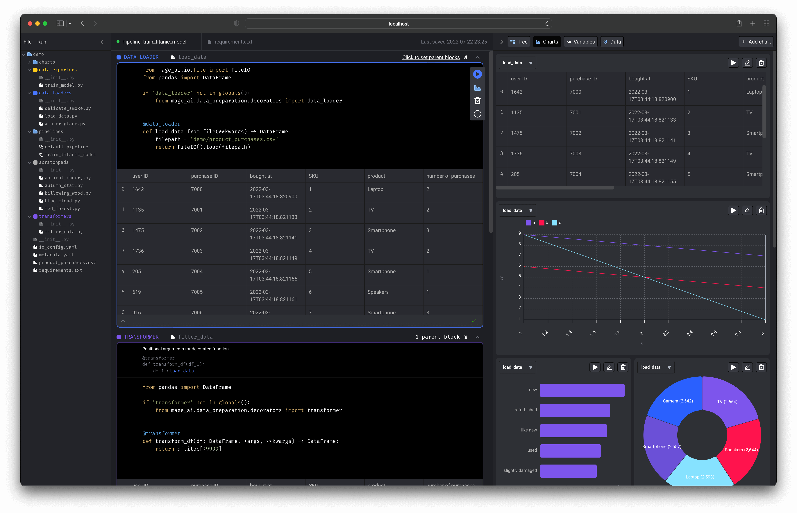

# 🔮 Features

## 🏔️ Core design principles

### 💻 Easy developer experience
- Mage comes with a specialized notebook UI for building data pipelines.
- Use Python and SQL (more languages coming soon) together in the same pipeline for ultimate flexibility.
- Set up locally and get started developing with a single command.
- Deploying to production is fast using native integrations with major cloud providers.

### 🚢 Engineering best practices built-in
- Writing reusable code is easy because every block in your data pipeline is a standalone file.
- Data validation is written into each block and tested every time a block is ran.
- Operationalizing your data pipelines is easy with built-in monitoring and observability.
- Each block of code has a single responsibility: load data from a source, transform data, or export data anywhere.

### 💳 Data is a 1st class citizen
- Datasets are created whenever blocks are ran.
- Every dataset can be automatically partitioned.
- Each pipeline and dataset can be versioned.
- Backfilling datasets is a core function and operation.

### 🪐 Scaling made simple
- Transform very large datasets through a native integration with Spark.
- Handle data intensive transformations with built-in distributed computing (e.g. Dask, Ray).
- Run thousands of pipelines simultaneously and manage transparently through a collaborative UI.
- Execute SQL queries in your data warehouse to process heavy workloads.

## More features

1. [Data centric editor](#1-data-centric-editor)
1. [Production ready code](#2-production-ready-code)
1. [Extensible](#3-extensible)

### 1. Data centric editor
An interactive coding experience designed for preparing data to train ML models.

Visualize the impact of your code every time you load, clean, and transform data.

### 2. Production ready code
No more writing throw away code or trying to turn notebooks into scripts.

Each block (aka cell) in this editor is a modular file that can be tested, reused,
and chained together to create an executable data pipeline locally or in any environment.

Read more about <b>[blocks](docs/blocks/README.md)</b> and how they work.

Run your data pipeline end-to-end using the command line function: `$ mage run [project] [pipeline]`

You can run your pipeline in production environments with the orchestration tools
* [Airflow](docs/production/airflow.md)
* [Prefect](docs/production/prefect.md)
* Dagster (Tutorial coming soon)

### 3. Extensible
Easily add new functionality directly in the source code or through plug-ins (coming soon).

Adding new API endpoints ([Tornado](https://www.tornadoweb.org/en/stable/)),
transformations (Python, PySpark, SQL),
and charts (using [React](https://reactjs.org/)) is easy to do (tutorial coming soon).

### New features and changelog
Check out what’s new [here](https://mageai.notion.site/What-s-new-7cc355e38e9c42839d23fdbef2dabd2c).
