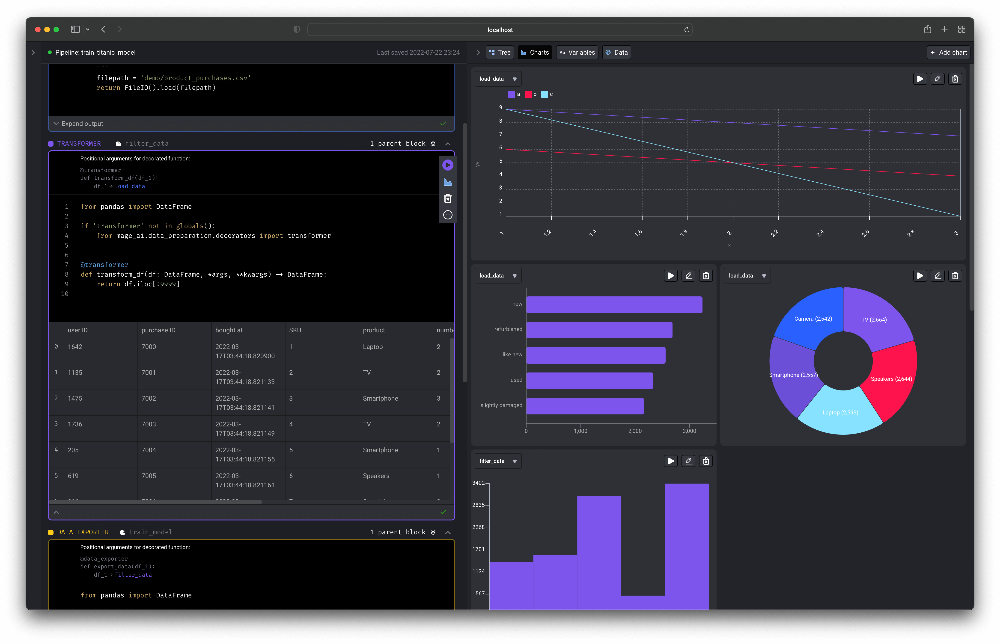
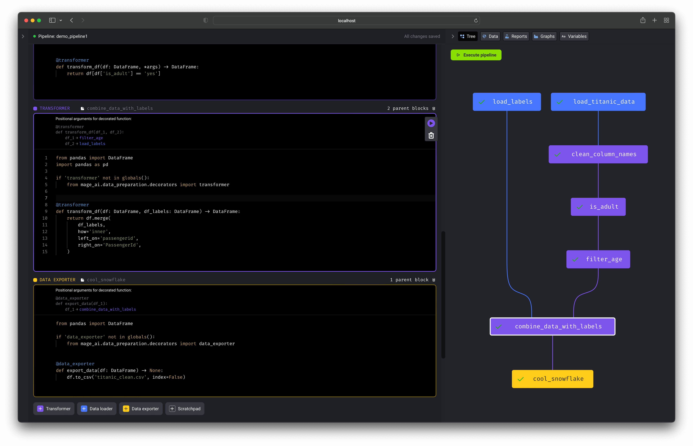
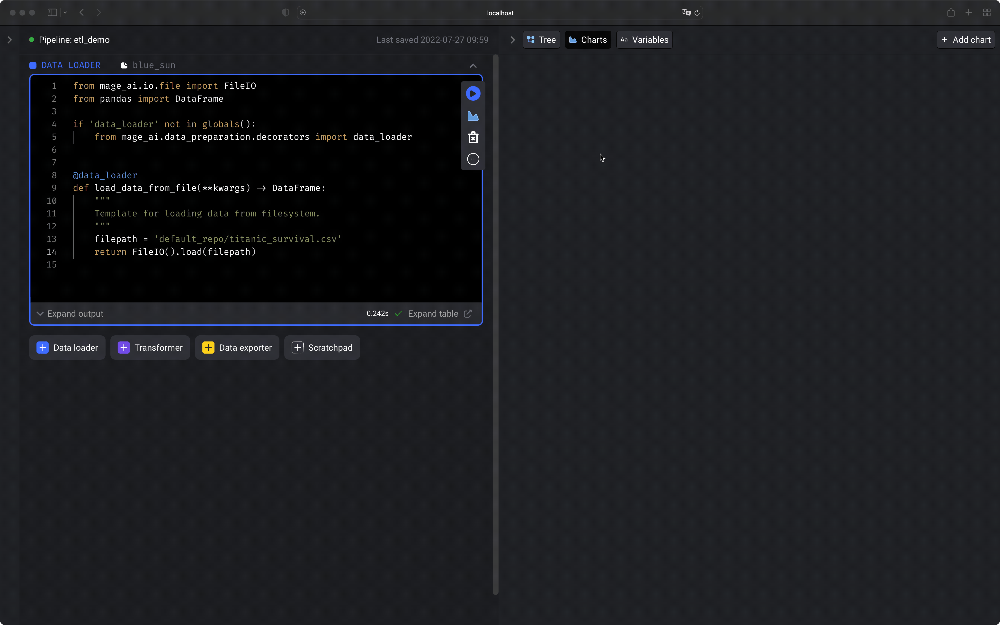

# 🔮 Features

- [Data pipeline management](#data-pipeline-management)
- [Notebook for building data pipelines](#notebook-for-building-data-pipelines)
- [Roadmap](https://airtable.com/shrJS0cDOmQywb8vp)
- [Changelog](https://mageai.notion.site/What-s-new-7cc355e38e9c42839d23fdbef2dabd2c)

 

## Data pipeline management

Read more [details here](orchestration/README.md).

 

## Notebook for building data pipelines

### 1. Data centric editor
An interactive coding experience designed for preparing data to train ML models.

Visualize the impact of your code every time you load, clean, and transform data.

### 2. Production ready code
No more writing throw away code or trying to turn notebooks into scripts.

Each block (aka cell) in this editor is a modular file that can be tested, reused,
and chained together to create an executable data pipeline locally or in any environment.

Read more about <b>[blocks](docs/blocks/README.md)</b> and how they work.

Run your data pipeline end-to-end using the command line function: `$ mage run [project] [pipeline]`

You can run your pipeline in production environments with the orchestration tools
* [Airflow](docs/production/airflow.md)
* [Prefect](docs/production/prefect.md)
* Dagster (Tutorial coming soon)

### 3. Extensible
Easily add new functionality directly in the source code or through plug-ins (coming soon).

Adding new API endpoints ([Tornado](https://www.tornadoweb.org/en/stable/)),
transformations (Python, PySpark, SQL),
and charts (using [React](https://reactjs.org/)) is easy to do (tutorial coming soon).

 
