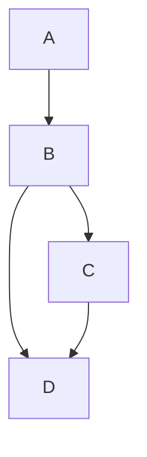

import { ProButton } from '/snippets/pro/button.mdx';
import { ProOnly } from '/snippets/pro/only.mdx';

## Memory optimizations

In version 1.0 of dynamic blocks,
Mage was loading all the data of an upstream dynamic child block from disk into memory
in order to calculate how many dynamic child blocks should be created.
This can result in using large amounts of memory.

In version 2.0 of dynamic blocks,
Mage leverages the metadata of upstream block outputs
to calculate the number of downstream blocks for dynamic blocks and dynamic child blocks.
The metadata is only several bytes on disk and less than a kilobyte in RAM.

## Stream mode

Stream block output data to dynamically generated blocks without waiting for the upstream parent
block to finish executing.

<ProOnly source="dynamic-blocks-2__stream-mode" />

Here is a sample scenario to describe the previous and current state:

1. Dynamic block A returns a list of 10 items and has 1 direct downstream block B.
2. B is a dynamic child block and has 2 direct downstream block: C and D.
3. C is a dynamic child block and has 1 direct downstream block: D.



In the past, this is the sequence of events:

1. Block A finishes executing and returns an output of 10 items.
2. Block B spawns 10 dynamic child blocks.
3. Block B executes all 10 dynamic blocks concurrently.
4. Once all 10 block runs from block B finishes, block C starts.
5. Block C spawns 10 child blocks and executes them.
6. Once Block C completes all 10 runs, block D starts.
7. Block D spawns 100 child blocks and executes them.

With dynamic block 2.0, you can enable stream mode which will allow downstream dynamic child blocks to execute as soon as its upstream parent dynamic child blocks finish. Here is the sequence of events in the new world:

1. Block A executes and can be handled in 2 ways:
    1. Serial: block A executes its code line by line and at the end, the return statement outputs the entire result of 10 items in a list.
    2. Generator: block A executes its code line by line up until a yield block. Once yield is called, the object that is yielded is stored as an output of block A. In this example, block A would yield 10 times, 1 for each item.
2. As soon as 1 output is detected from block A, block B spawns 1 dynamic child that consumes that single output as its input argument.
3. As soon as 1 output is detected from block B, block C spawns 1 dynamic child.
4. As soon as 1 output is detected from both block B and block C, block D spawns 1 dynamic child.

## Enabling stream mode

Stream mode allows downstream dynamic child blocks to execute without waiting for every upstream block to finish, improving pipeline performance.

### Accessing block settings

To enable stream mode, access the Dynamic block v2 configuration:

1. Click the **block settings button** next to the "Run code" button
    - Alternatively, use the **Block settings** tab in the right side navigation menu

### Configuration

1. Scroll down to the "Dynamic block v2 configuration" section
2. Select **"Stream"** from the Mode dropdown
3. Enter a **poll interval** in seconds - this is how often the system checks for new data or completed upstream blocks. Lower values (like 1 second) provide faster response times but use more system resources
4. **(Optional)** Toggle **"Combine all output into 1"** to consolidate outputs for downstream processing

Stream mode enables parallel processing and better resource utilization by allowing child blocks to start processing data as it becomes available.


## Memory generator

If a dynamic block contains a yield block,
the object yielded will be an output from that block. Once that object is stored,
it is released from memory and the next object in the generator within that block
is processed and loaded into memory.

<ProOnly source="dynamic-blocks-2__memory-generator" />

For example, if you want to loop through a total of 1 billion indexes in 1 million increments
so that you can load 1 million records into memory, you can use a yield block to process a
batch of 1 million, then yield the result as an output, release it from memory automatically,
and then proceed to the next batch.

```python
@custom
def process(*args, **kwargs):
    for i in range(1_000):
		    yield range(i * 1_000_000, (i + 1) * 1_000_000)
```
