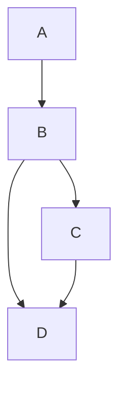
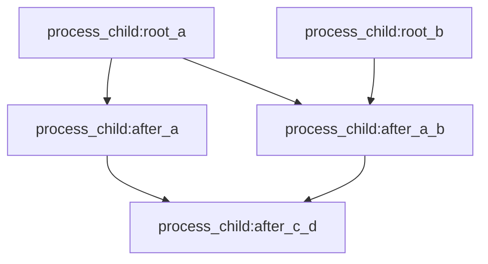

import { ProButton } from '/snippets/pro/button.mdx';
import { ProOnly } from '/snippets/pro/only.mdx';

## Memory optimizations

In version 1.0 of dynamic blocks,
Mage was loading all the data of an upstream dynamic child block from disk into memory
in order to calculate how many dynamic child blocks should be created.
This can result in using large amounts of memory.

In version 2.0 of dynamic blocks,
Mage leverages the metadata of upstream block outputs
to calculate the number of downstream blocks for dynamic blocks and dynamic child blocks.
The metadata is only several bytes on disk and less than a kilobyte in RAM.

## Stream mode

Stream block output data to dynamically generated blocks without waiting for the upstream parent
block to finish executing.

<ProOnly source="dynamic-blocks-2__stream-mode" />

Here is a sample scenario to describe the previous and current state:

1. Dynamic block A returns a list of 10 items and has 1 direct downstream block B.
2. B is a dynamic child block and has 2 direct downstream block: C and D.
3. C is a dynamic child block and has 1 direct downstream block: D.


```mermaid
graph TD
  A --> B
  B --> C
  B --> D
  C --> D
```

In the past, this is the sequence of events:

1. Block A finishes executing and returns an output of 10 items.
2. Block B spawns 10 dynamic child blocks.
3. Block B executes all 10 dynamic blocks concurrently.
4. Once all 10 block runs from block B finishes, block C starts.
5. Block C spawns 10 child blocks and executes them.
6. Once Block C completes all 10 runs, block D starts.
7. Block D spawns 100 child blocks and executes them.

With dynamic block 2.0, you can enable stream mode which will allow downstream dynamic child blocks to execute as soon as its upstream parent dynamic child blocks finish. Here is the sequence of events in the new world:

1. Block A executes and can be handled in 2 ways:
    1. Serial: block A executes its code line by line and at the end, the return statement outputs the entire result of 10 items in a list.
    2. Generator: block A executes its code line by line up until a yield block. Once yield is called, the object that is yielded is stored as an output of block A. In this example, block A would yield 10 times, 1 for each item.
2. As soon as 1 output is detected from block A, block B spawns 1 dynamic child that consumes that single output as its input argument.
3. As soon as 1 output is detected from block B, block C spawns 1 dynamic child.
4. As soon as 1 output is detected from both block B and block C, block D spawns 1 dynamic child.

## Generated child dependencies

Dynamic block metadata can also define dependencies between generated child block runs.
Use this when a dynamic parent emits many children for the same downstream block, but some
generated children must wait for other generated children before they run.

For example, a dynamic parent can emit five generated children for a downstream transformer:

```python
from typing import Dict, List


@data_loader
def load_data(*args, **kwargs) -> List[List[Dict]]:
    rows = [
        dict(child_id='root_a', sleep_seconds=4),
        dict(child_id='root_b', sleep_seconds=4),
        dict(child_id='after_a', sleep_seconds=1),
        dict(child_id='after_a_b', sleep_seconds=1),
        dict(child_id='after_c_d', sleep_seconds=1),
    ]

    metadata = [
        dict(block_uuid='root_a'),
        dict(block_uuid='root_b'),
        dict(block_uuid='after_a', upstream_blocks=['root_a']),
        dict(block_uuid='after_a_b', upstream_blocks=['root_a', 'root_b']),
        dict(block_uuid='after_c_d', upstream_blocks=['after_a', 'after_a_b']),
    ]

    return [
        rows,
        metadata,
    ]
```

If the downstream transformer block UUID is `process_child`, Mage creates these block runs:

| Generated block run UUID | Metadata dependency | Scheduling behavior |
| --- | --- | --- |
| `process_child:root_a` | None | Can run as soon as the dynamic parent and static upstreams are ready. |
| `process_child:root_b` | None | Can run as soon as the dynamic parent and static upstreams are ready. |
| `process_child:after_a` | `root_a` | Waits for `process_child:root_a`. |
| `process_child:after_a_b` | `root_a`, `root_b` | Waits for `process_child:root_a` and `process_child:root_b`. |
| `process_child:after_c_d` | `after_a`, `after_a_b` | Waits for `process_child:after_a` and `process_child:after_a_b`. |

The dependency graph for the generated child runs is:


```mermaid
graph TD
  root_a["process_child:root_a"] --> after_a["process_child:after_a"]
  root_a --> after_a_b["process_child:after_a_b"]
  root_b["process_child:root_b"] --> after_a_b
  after_a --> after_c_d["process_child:after_c_d"]
  after_a_b --> after_c_d
```

### Metadata keys

Add these keys to each metadata dictionary returned by the dynamic parent:

| Key | Type | Required | Description |
| --- | --- | --- | --- |
| `block_uuid` | string | Yes | Stable name for the generated child. Mage combines this with the downstream block UUID using the format `[downstream_block_uuid]:[block_uuid]`. |
| `upstream_blocks` | list of strings | No | Generated child dependencies that must finish before this generated child can run. |
| `dynamic_upstream_block_uuids` | list of strings | No | Alternate dependency key for generated child dependencies. Use `upstream_blocks` for new dynamic parent metadata unless you already produce this key. |

Each dependency can be written as a short generated child name, a full generated block run UUID,
or a normal static block UUID:

```python
dict(block_uuid='after_a', upstream_blocks=['root_a'])
dict(block_uuid='after_a', upstream_blocks=['process_child:root_a'])
dict(block_uuid='after_a', upstream_blocks=['load_shared_inputs'])
```

The first two examples make `process_child:after_a` wait for `process_child:root_a`.
The third example makes `process_child:after_a` wait for the static block run
`load_shared_inputs`.
When the dependency value does not contain `:`, Mage treats it as a generated child name for the
same downstream block if that generated child exists. When the dependency value already contains
`:`, Mage treats it as the exact block run UUID. Use the full UUID form to depend on a generated
child from another downstream block, such as `validate_child:root_a`.

### Scheduling behavior

Generated child dependencies are enforced after the normal pipeline dependency checks.
That means a generated child can run only when both of these are true:

1. The dynamic parent and the downstream block's static upstream chain are ready.
2. Every generated child listed in that generated child's metadata dependencies has finished.

Children with no metadata dependencies can run concurrently. Children with one or more metadata
dependencies remain queued until those generated upstream children finish.

These metadata dependencies control scheduling only. They do not change the input data passed to
the child block. To pass data between generated children, write and read it explicitly using normal
block output, variables, storage, or another shared data location.

Make sure every metadata dependency points to a block run that will exist in the same pipeline run.
If a dependency references a generated child that is never created, the waiting generated child will
not become executable because its declared upstream never finishes.

If a downstream dynamic child has **Reduce output** enabled, Mage still enforces the metadata
dependencies before the generated child block runs. The reduce step happens after the generated
children complete, so downstream reduced blocks receive the combined outputs only after the
dependency-constrained child runs have finished.

## Enabling stream mode

Stream mode allows downstream dynamic child blocks to execute without waiting for every upstream block to finish, improving pipeline performance.

### Accessing block settings

To enable stream mode, access the Dynamic block v2 configuration:

1. Click the **block settings button** next to the "Run code" button
    - Alternatively, use the **Block settings** tab in the right side navigation menu

### Configuration

1. Scroll down to the "Dynamic block v2 configuration" section
2. Select **"Stream"** from the Mode dropdown
3. Enter a **poll interval** in seconds - this is how often the system checks for new data or completed upstream blocks. Lower values (like 1 second) provide faster response times but use more system resources
4. **(Optional)** Toggle **"Combine all output into 1"** to consolidate outputs for downstream processing

Stream mode enables parallel processing and better resource utilization by allowing child blocks to start processing data as it becomes available.


## Memory generator

If a dynamic block contains a yield block,
the object yielded will be an output from that block. Once that object is stored,
it is released from memory and the next object in the generator within that block
is processed and loaded into memory.

<ProOnly source="dynamic-blocks-2__memory-generator" />

For example, if you want to loop through a total of 1 billion indexes in 1 million increments
so that you can load 1 million records into memory, you can use a yield block to process a
batch of 1 million, then yield the result as an output, release it from memory automatically,
and then proceed to the next batch.

```python
@custom
def process(*args, **kwargs):
    for i in range(1_000):
		    yield range(i * 1_000_000, (i + 1) * 1_000_000)
```
