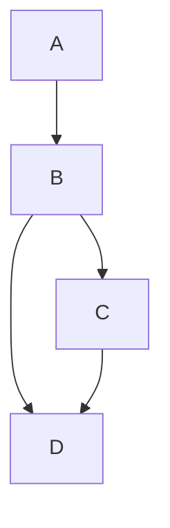

## Build pipeline

1. Add a new data loader block.
1. Paste in the following code:
    ```python
    from typing import Dict, List


    @data_loader
    def load_data(*args, **kwargs) -> List[List[Dict]]:
        users = []
        metadata = []

        for i in range(3):
            i += 1
            users.append(dict(id=i, name=f'user_{i}'))
            metadata.append(dict(block_uuid=f'for_user_{i}'))

        return [
            users,
            metadata,
        ]
    ```
1. Run the data loader block and the output will be:
    ```python
    [{'id': 1, 'name': 'user_1'},
     {'id': 2, 'name': 'user_2'},
     {'id': 3, 'name': 'user_3'}]
    ```
1. In the top right corner of the block, click on the triple dot button (`...`) and click the
dropdown selection labeled `Set block as dynamic`.
    
1. Add a new transformer block.
1. Paste in the following code:
    ```python
    from typing import Dict, List


    @transformer
    def transform(data: Dict, *args, **kwargs) -> List[Dict]:
        data['id'] = int(data['id']) * 100
        return [data]
    ```
1. Run the transformer block and the output will be:
    ```python
    {'id': 100, 'name': 'user_1'}
    ```

    
1. Add another transformer block.
1. Paste in the following code:
    ```python
    from typing import Dict, List
    import uuid


    @transformer
    def transform(data: Dict, *args, **kwargs) -> List[Dict]:
        data['token'] = uuid.uuid4().hex
        return [data]
    ```
1. Change the 2nd transformer block’s upstream parent block to only be the data loader.
This will require you to remove the existing upstream parent block which is currently pointing to
the 1st transformer block.
1. In the top right corner of this 2nd transformer block,
click on the triple dot button (`...`) and click the
dropdown selection labeled `Reduce output`.
1. Run the transformer block and the output should look something like this:
    ```python
    {'id': 1, 'name': 'user_1', 'token': '0ea0f28c2de647d997e5c341a857c92f'}
    ```

    
1. Add a new data exporter block.
1. Paste in the following code:
    ```python
    from typing import Dict, List


    @data_exporter
    def export_data(users: List[Dict], **kwargs):
        print(users)
    ```
1. Run the data exporter block and the output should look something like this:
    ```python
    [{'id': 1, 'name': 'user_1', 'token': 'bc35e36ecfc24d77a2d910f4b1d6611d'}]
    ```

    When executing the entire pipeline, this output will contain 3 items in this list.

    

The pipeline’s final dependency graph should look like this:


## Run pipeline

1. Click the pipeline name in the top left corner (e.g the breadcrumbs).
This will take you to the pipeline’s trigger page.
1. Click the button `[Run @once]` in the page's subheader,
or create a trigger to run once.
1. Click the name of the newly created trigger.
1. The trigger will create 1 pipeline run with 9 block runs.

The block runs should look like this:


## Dynamic blocks 2.0

import { ProButton } from '/snippets/pro/button.mdx';
import { ProOnly } from '/snippets/pro/only.mdx';

<ProOnly source="dynamic-blocks-2__stream-mode" />

In version 1.0 of dynamic blocks,
Mage was loading all the data of an upstream dynamic child block from disk into memory
in order to calculate how many dynamic child blocks should be created.
This can result in using large amounts of memory.

In version 2.0 of dynamic blocks,
Mage leverages the metadata of upstream block outputs
to calculate the number of downstream blocks for dynamic blocks and dynamic child blocks.
The metadata is only several bytes on disk and less than a kilobyte in RAM.

### Stream mode

Here is a sample scenario to describe the previous and current state:

1. Dynamic block A returns a list of 10 items and has 1 direct downstream block B.
2. B is a dynamic child block and has 2 direct downstream block: C and D.
3. C is a dynamic child block and has 1 direct downstream block: D.



In the past, this is the sequence of events:

1. Block A finishes executing and returns an output of 10 items.
2. Block B spawns 10 dynamic child blocks.
3. Block B executes all 10 dynamic blocks concurrently.
4. Once all 10 block runs from block B finishes, block C starts.
5. Block C spawns 10 child blocks and executes them.
6. Once Block C completes all 10 runs, block D starts.
7. Block D spawns 100 child blocks and executes them.

With dynamic block 2.0, you can enable stream mode which will allow downstream dynamic child blocks to execute as soon as its upstream parent dynamic child blocks finish. Here is the sequence of events in the new world:

1. Block A executes and can be handled in 2 ways:
    1. Serial: block A executes its code line by line and at the end, the return statement outputs the entire result of 10 items in a list.
    2. Generator: block A executes its code line by line up until a yield block. Once yield is called, the object that is yielded is stored as an output of block A. In this example, block A would yield 10 times, 1 for each item.
2. As soon as 1 output is detected from block A, block B spawns 1 dynamic child that consumes that single output as its input argument.
3. As soon as 1 output is detected from block B, block C spawns 1 dynamic child.
4. As soon as 1 output is detected from both block B and block C, block D spawns 1 dynamic child.
