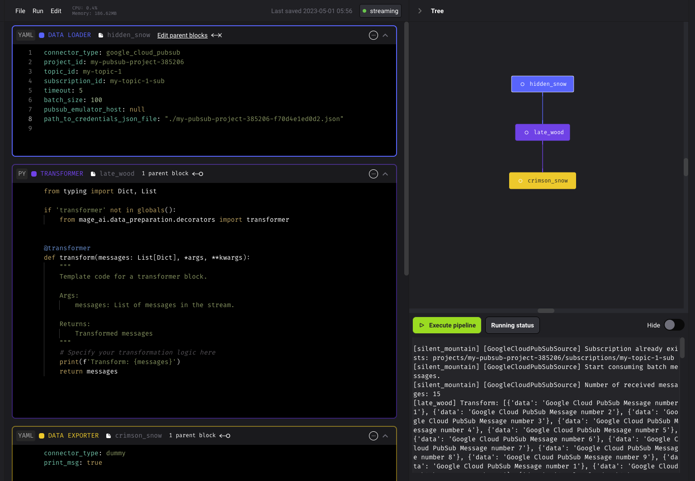

<br />

## Config

```yaml
connector_type: google_cloud_pubsub
project_id: test-project-id
topic_id: test-topic-id
subscription_id: test-subscription-id-0
timeout: 5
batch_size: 100
pubsub_emulator_host: "host.docker.internal:8085"
google_application_credentials: str = None  # e.g., "./google_credentials.json"
```

## Set up Google Cloud Pubsub emulator

To test out Google Cloud PubSub source locally, follow the instructions in
[Testing apps locally with the emulator](https://cloud.google.com/pubsub/docs/emulator)
to set up the local Google Cloud PubSub emulator.

## Create a `project_id` for testing

Use the command listed under the `Starting the emulator` section to create a `project_id`, e.g.,

```
gcloud beta emulators pubsub start --project=test-project-id

$(gcloud beta emulators pubsub env-init)
```

## Create a topic and a subscription

Use the `gcloud pubsub topics create` command to create a topic:

```
gcloud pubsub topics create test-topic-id
```

After you create a topic, you can subscribe or publish to it. Use the
`gcloud pubsub subscriptions create` command to create a subscription.

```
gcloud pubsub subscriptions create test-subscription-id-0 --topic test-topic-id
```

Only messages published to the topic after the subscription is created
are available to subscriber applications.

## Start Mage

### Create a new pipeline

1. Open Mage in your browser.
2. Click <b>`+ New pipeline`</b>, then select `Streaming`.
3. Add a data loader block, select `Google Cloud PubSub`, and paste the following:

    ```yaml
    connector_type: google_cloud_pubsub
    project_id: test-project-id
    topic_id: test-topic-id
    subscription_id: test-subscription-id-0
    timeout: 5
    batch_size: 100
    pubsub_emulator_host: "host.docker.internal:8085"
    google_application_credentials: str = None  # e.g., "./google_credentials.json"
    ```

4. Add a transformer block and paste the following:

    ```python
    from typing import Dict, List

    if 'transformer' not in globals():
        from mage_ai.data_preparation.decorators import transformer


    @transformer
    def transform(messages: List[Dict], *args, **kwargs):
        """
        Template code for a transformer block.

        Args:
            messages: List of messages in the stream.

        Returns:
            Transformed messages
        """
        # Specify your transformation logic here
        print(messages)
        return messages
    ```

5. Add a data exporter block, select `Dummy` and keep the default settings:

    ```yaml
    connector_type: dummy
    print_msg: true
    ```


---

## Test pipeline

Open the streaming pipeline you just created, and in the right side panel near
the bottom, click the button <b>Execute pipeline</b> to test the pipeline.

### Publish some testing messages

Please use the publisher example given in the [Testing apps locally with the emulator](https://cloud.google.com/pubsub/docs/emulator)

```
python publisher.py test-project-id publish test-topic-id
```

You should see an output similar to the following:

```
[still_brook] [GoogleCloudPubSubSource] Subscription already exists: projects/test-project-id/subscriptions/test-subscription-id-0
[still_brook] [GoogleCloudPubSubSource] Start consuming messages.
[still_brook] [GoogleCloudPubSubSource] Number of received messages: 9
[still_brook] [GoogleCloudPubSubSource] Received: b'Message number 1'.
[red_sun] {'data': 'Message number 1'}
[still_brook] [DummySink] Batch ingest 1 records, time=1682669990.5688324. Sample: {'data': 'Message number 1'}
[still_brook] [GoogleCloudPubSubSource] Handled: b'Message number 1'.

......

Pipeline still_brook execution complete.
You can see the code block output in the corresponding code block.
```
