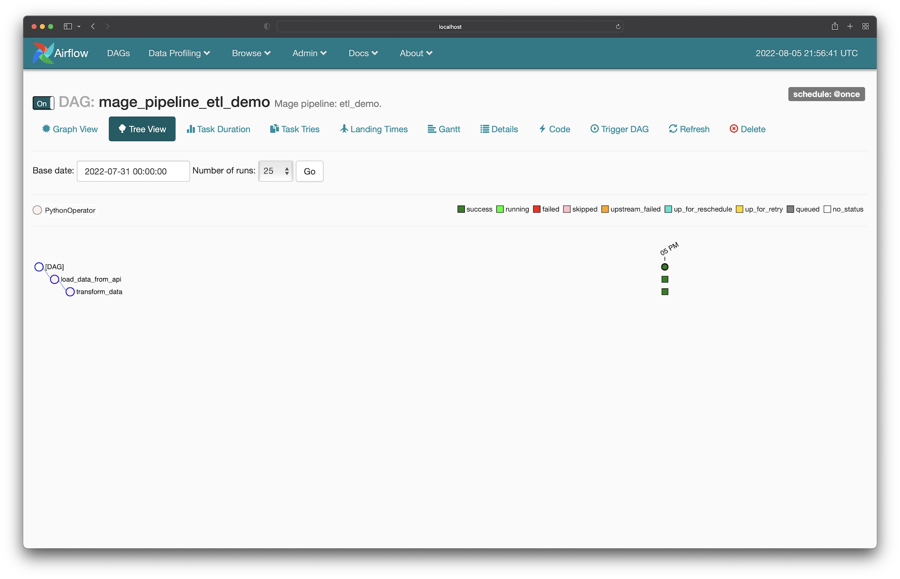

# Integrate Mage into an existing Airflow project


In this tutorial, we’ll create a DAG in Airflow for scheduling and
running a data pipeline; all from the Mage UI.

> 🤔 <b>Note</b>
>
> This tutorial requires that you already have Airflow setup and running locally.

## Table of contents
1. [Add `mage-ai` as a dependency in Airflow](#1-add-mage-ai-as-a-dependency-in-airflow)
1. [Install Mage tool](#2-install-mage-tool)
1. [Initialize Mage project](#3-initialize-mage-project)
1. [Create one-time DAG for pipelines](#4-create-one-time-dag-for-pipelines)
1. [Create pipeline](#5-create-pipeline)
1. [Run DAG in Airflow for pipeline](#6-run-dag-in-airflow-for-pipeline)

## 1. Add `mage-ai` as a dependency in Airflow
Open the `requirements.txt` file in the root directory of your Airflow project,
and add the `mage-ai` library:

```
mage-ai
```

## 2. Install Mage tool
You can install and run Mage using Docker or using pip.

### Using Docker
```bash
docker pull mageai/mageai:latest
```

### Using pip
```bash
pip install mage-ai
```

## 3. Initialize Mage project

Change directory into your Airflow’s DAGs folder. This is typically in the folder `dags/`.

```bash
cd dags
```

Then, initialize a new Mage project in the `dags/` folder.

If you’re using Docker, run the following command in the `dags/` folder:

```bash
docker run mageai/mageai mage init demo_project
```

If you used pip to install Mage, run the following command in the `dags/` folder:

```bash
mage init demo_project
```

Once finished, you should have a folder named `demo_project` inside your `dags/` folder.

Your current folder structure should look like this:

```
airflow_root_directory/
| -- dags/
| -- | -- demo_project/
```

## 4. Create one-time DAG for pipelines

In the `dags/` folder, create a new file named `create_mage_pipelines.py`.

Then, add the following code:

```python
from airflow import DAG
from airflow.operators.python_operator import PythonOperator
from datetime import datetime
from mage_ai.orchestration.airflow import create_dags
import os


ABSOLUTE_PATH = os.path.abspath(os.path.dirname(__file__))
project_path = os.path.join(ABSOLUTE_PATH, 'demo_project')

create_dags(
    project_path,
    DAG,
    PythonOperator,
    dag_settings=dict(
        start_date=datetime(2022, 8, 5),  # Change this to any start date you want
    ),
    globals_dict=globals(),
)
```

## 5. Create pipeline

### 5a. Start Mage

In the `dags/` folder, start the Mage tool.

If you’re using Docker, run the following command in the `dags/` folder:

```bash
docker run \
  -p 6789:6789 \
  -v demo_project:/home/src/demo_project \
  mageai/mageai \
  mage start demo_project
```

If you used pip to install Mage, run the following command in the `dags/` folder:

```bash
mage start demo_project
```

Open [http://localhost:6789](http://localhost:6789) in your browser.

### 5b. Create a pipeline and add a block

Follow steps 1, 2, and 4 in this [tutorial](../../quick_start/etl_restaurant/README.md)
to create a new pipeline, add 1 data loader block, and add 1 transformer block.

### 6. Run DAG in Airflow for pipeline

1. Open the Airflow webserver UI at [http://localhost:8080](http://localhost:8080) in your browser.
1. If you named your pipeline `etl demo` based on the tutorial from the previous step,
then find a DAG named `mage_pipeline_etl_demo`. If you named it something else, find a DAG with the prefix `mage_pipeline_`.
1. Click on the DAG to view the detail page. The URL could typically be this: [http://localhost:8080/admin/airflow/tree?dag_id=mage_pipeline_etl_demo](http://localhost:8080/admin/airflow/tree?dag_id=mage_pipeline_etl_demo).
1. Turn that DAG on if its currently off.
1. Trigger a new DAG run.
1. Watch the DAG as it runs each task according to the pipeline you created in Mage.


