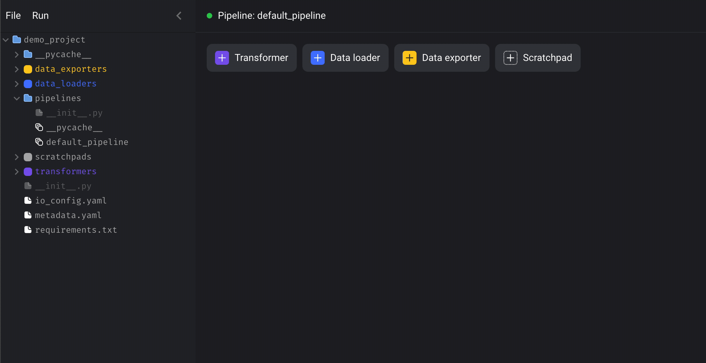
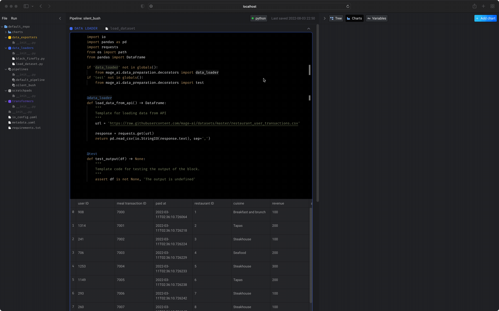
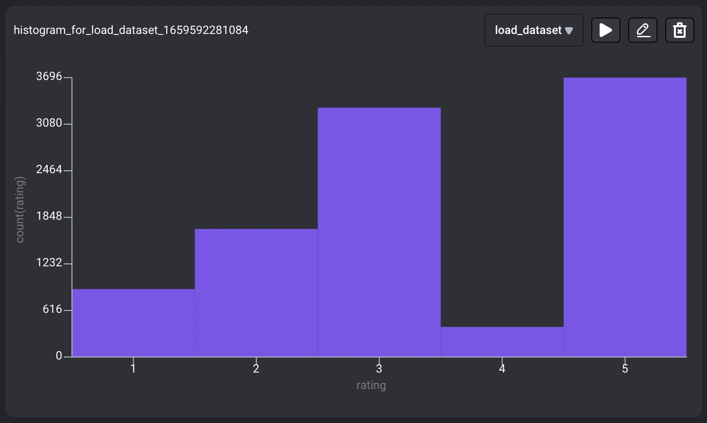
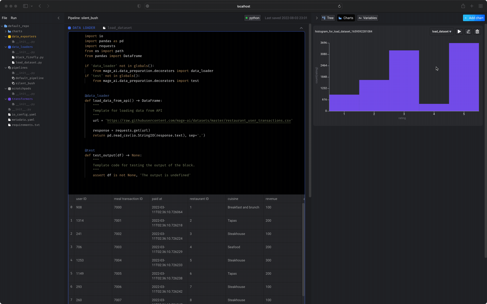
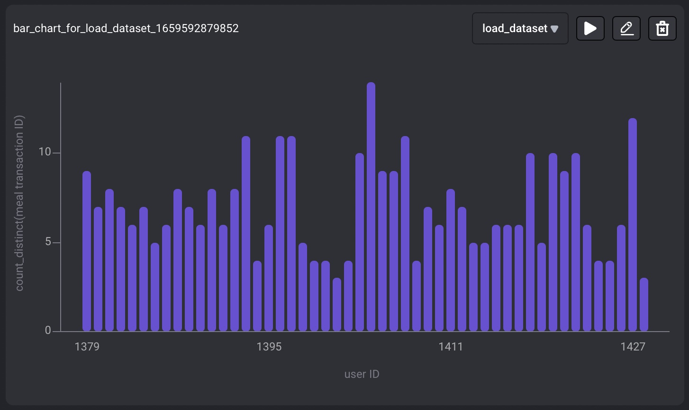
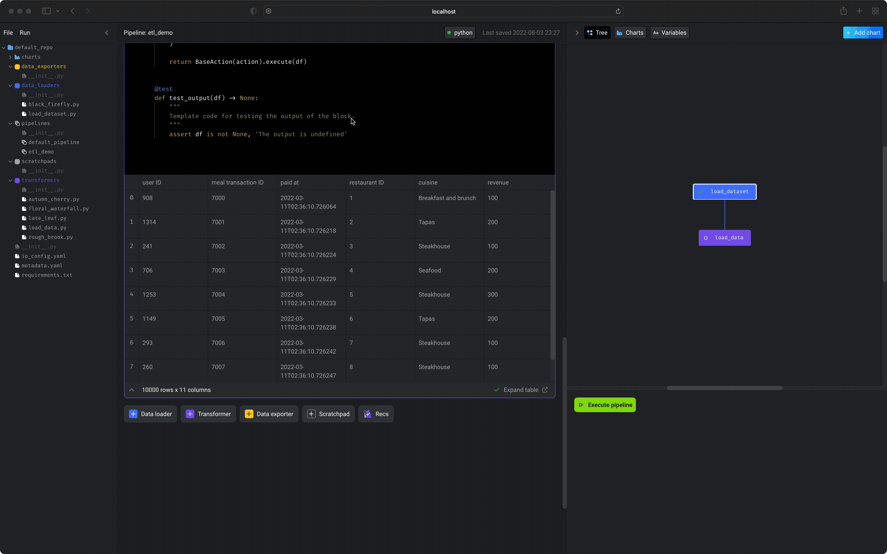

# Load, transform, and export restaurant data


In this tutorial, we’ll create a data pipeline that does the following:

1. Load data from an online endpoint
2. Visualize the data using charts
3. Transform the data and create 2 new columns
4. Write the transformed data to PostgreSQL

If you prefer to skip the tutorial and view the finished code,
follow [this guide](use_completed_pipeline.md).

If you haven’t setup a project before, check out the [setup guide](../setup.md) before starting.

## Table of contents

1. [Create new pipeline](#1-create-new-pipeline)
1. [Load data](#2-load-data)
1. [Visualize data](#3-visualize-data)
1. [Transform data](#4-transform-data)
1. [Export data to PostgreSQL](#5-export-data-to-postgresql)
1. [Validate data was exported](#6-validate-data-was-exported)

## 1. Create new pipeline

In the top left corner, click `File > New pipeline`.
Then, click the name of the pipeline and rename it to `etl demo`.



## 2. Load data

1. Click the `+ Data loader` button, select `Python`, then click the template called `API`.
2. Rename the block to `load dataset`.
3. In the function named `load_data_from_api`, set the `url` variable to:
`https://raw.githubusercontent.com/mage-ai/datasets/master/restaurant_user_transactions.csv`.
4. Run the block by clicking the play icon button or using the keyboard shortcuts `⌘ + Enter`, `Control + Enter`, or `Shift + Enter`.

After you run the block (⌘ + Enter),
you can immediately see a sample of the data in the block’s output.


Here is what the code should look like:

```python
import io
import pandas as pd
import requests
from pandas import DataFrame

if 'data_loader' not in globals():
    from mage_ai.data_preparation.decorators import data_loader
if 'test' not in globals():
    from mage_ai.data_preparation.decorators import test


@data_loader
def load_data_from_api() -> DataFrame:
    """
    Template for loading data from API
    """
    url = 'https://raw.githubusercontent.com/mage-ai/datasets/master/restaurant_user_transactions.csv'

    response = requests.get(url)
    return pd.read_csv(io.StringIO(response.text), sep=',')


@test
def test_output(df) -> None:
    """
    Template code for testing the output of the block.
    """
    assert df is not None, 'The output is undefined'
```

## 3. Visualize data

### 3a. Distribution of ratings

We’ll add a chart to visualize how frequent people
give 1 star, 2 star, 3 star, 4 star, or 5 star ratings.

1. Click the `+ Add chart` button in the top right corner, then click `Histogram`.
1. Click the pencil icon in the top right corner of the chart to edit the chart.
1. In the dropdown labeled "Number column for chart", select the column `rating`.
1. Click the play button icon in the top right corner of the chart to run the chart.



Your chart should look like:



### 3b. Number of meals per user

Let’s add another chart to see how many meals each user has.

1. Click the `+ Add chart` button in the top right corner, then click `Bar chart`.
1. Click the pencil icon in the top right corner of the chart to edit the chart.
1. In the dropdown labeled "Group by columns", select the column `user ID`.
1. Under the "Metrics" section, in the dropdown labeled "aggregation", select `count_distinct`.
1. Under the "Metrics" section, in the dropdown labeled "column", select `meal transaction ID`.
1. Click the play button icon in the top right corner of the chart to run the chart.



Your chart should look like:



## 4. Transform data

Let’s transform the data to add a column that counts the number of meals for each user.

1. Click the `+ Transformer` button, select `Python`, select `Aggregate`, then click `Aggregate by distinct count`.
2. Rename the block to `transform data`.
3. Change the argument named `arguments` to `arguments=['meal transaction ID']`.
4. In the dictionary with the `'groupby_columns'` key, change the value to `{'groupby_columns': ['user ID']}`.
5. Change the argument named `outputs` to:

```python
outputs=[
    {'uuid': 'number of meals', 'column_type': 'number'},
],
```

6. Run the block by clicking the play icon button or using the keyboard shortcuts `⌘ + Enter`, `Control + Enter`, or `Shift + Enter`.


Here is what the code should look like:

```python
from mage_ai.data_cleaner.transformer_actions.base import BaseAction
from mage_ai.data_cleaner.transformer_actions.constants import ActionType, Axis
from mage_ai.data_cleaner.transformer_actions.utils import build_transformer_action
from os import path
from pandas import DataFrame

if 'transformer' not in globals():
    from mage_ai.data_preparation.decorators import transformer
if 'test' not in globals():
    from mage_ai.data_preparation.decorators import test


@transformer
def execute_transformer_action(df: DataFrame, *args, **kwargs) -> DataFrame:
    """
    Execute Transformer Action: ActionType.COUNT_DISTINCT

    Docs: https://github.com/mage-ai/mage-ai/blob/master/docs/actions/transformer_actions/README.md#aggregation-actions
    """
    action = build_transformer_action(
        df,
        action_type=ActionType.COUNT_DISTINCT,
        action_code='',  # Enter filtering condition on rows before aggregation
        arguments=['meal transaction ID'],  # Enter the columns to compute aggregate over
        axis=Axis.COLUMN,
        options={'groupby_columns': ['user ID']},  # Enter columns to group by
        outputs=[
            # The number of outputs below must match the number of arguments
            {'uuid': 'number of meals', 'column_type': 'number'},
        ],
    )

    return BaseAction(action).execute(df)


@test
def test_output(df) -> None:
    """
    Template code for testing the output of the block.
    """
    assert df is not None, 'The output is undefined'
```

## 5. Export data to PostgreSQL

### 5a. Add PostgreSQL credentials in `io_config.yaml` file.

1. On the left side of the screen in the file browser, click on the file named `io_config.yaml`.
2. Then, paste the following credentials:

```yaml
version: 0.1.1
default:
  POSTGRES_DBNAME: mage/demo
  POSTGRES_HOST: db.bit.io
  POSTGRES_PASSWORD: v2_3t7Cc_BKPZndtNeYxqSVTatNphR4f
  POSTGRES_PORT: 5432
  POSTGRES_USER: mage
```

3. Save the file by pressing `⌘ + Enter` or `Control + Enter`.
4. Close the file by pressing the `X` button on the right of the file name at the top of the screen.



### 5b. Export data

1. Click the `+ Data exporter` button, select `Python`, and select the template called `PostgreSQL`.
1. Set `schema_name` to `public`.
1. Set `table_name` to `restaurant_data_transformed_something_unique`.
Note: change the `something_unique` part of the table name to something truly unique since you’ll be writing to the same demo database as others.
1. Execute the entire pipeline by pressing the `Execute pipeline` button on in your sidekick on the right.


Your output should look something like this:

```
[load_dataset] Executing data_loader block...
[load_dataset] DONE
[transform_data] Executing transformer block...
[transform_data] DONE
[export_data] Executing data_exporter block...
[export_data] Postgres initialized
├─ port_data] └─ Opening connection to PostgreSQL database...DONE
[export_data] └─ Exporting data frame to table 'public.restaurant_data_transformed_initial_demo'...DONE
[export_data] DONE
Pipeline etl_demo execution complete.
```

## 6. Validate data was exported

We can now query the transformed data from PostgreSQL.

1. Click the `+ Data loader` button, select `Python`, and select the template called `PostgreSQL`.
1. Set `query` to `SELECT * FROM restaurant_data_transformed_initial_demo`.
1. Run the block.


---

## Congratulations!

You’ve successfully built a pipeline for loading data, transforming it,
and exporting it to PostgreSQL.

If you have more questions or ideas, please
live chat with us in
[ Slack](https://www.mage.ai/chat)
